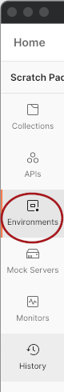
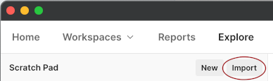
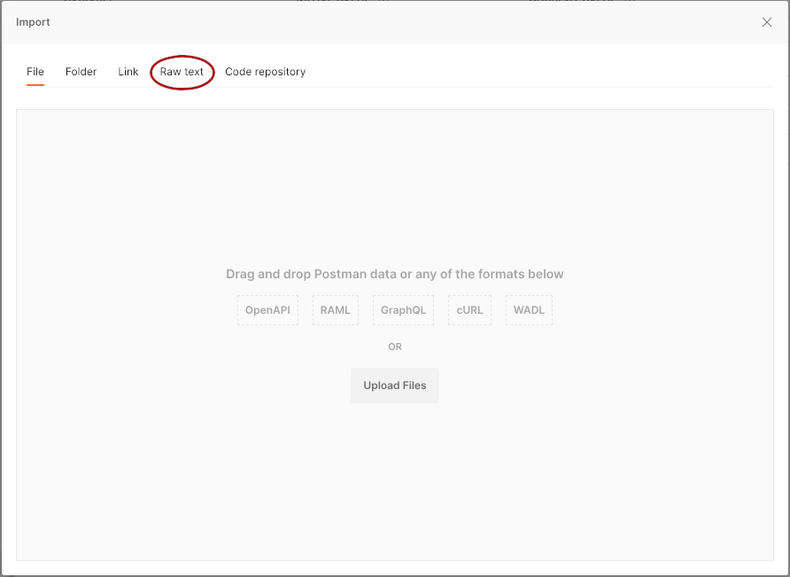
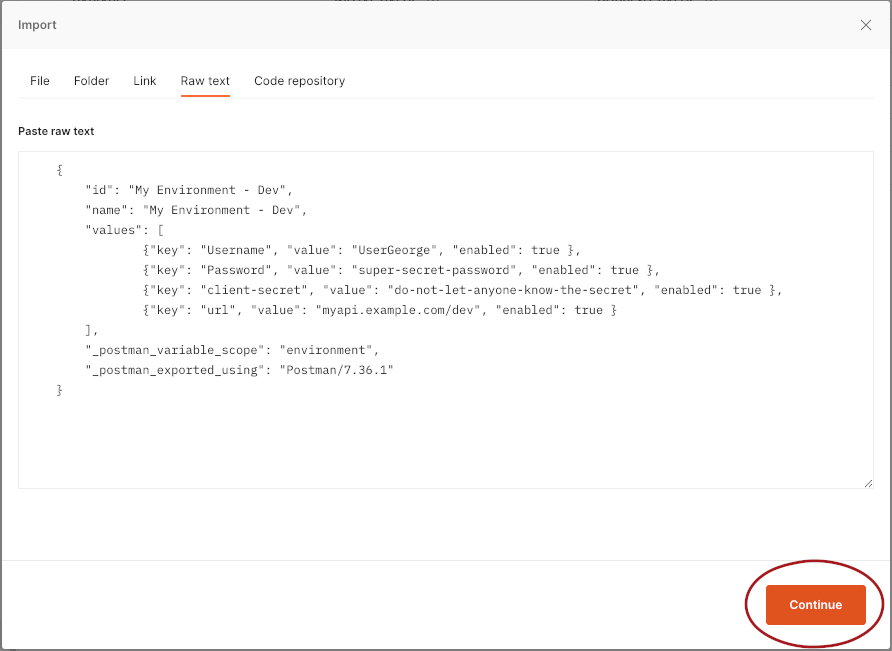
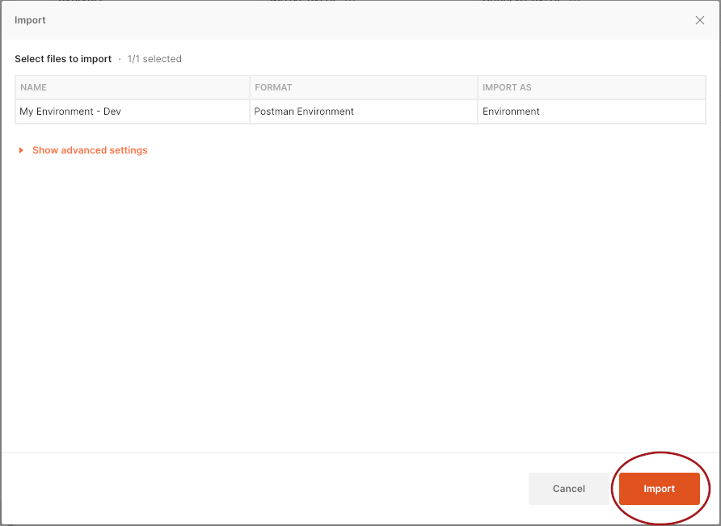
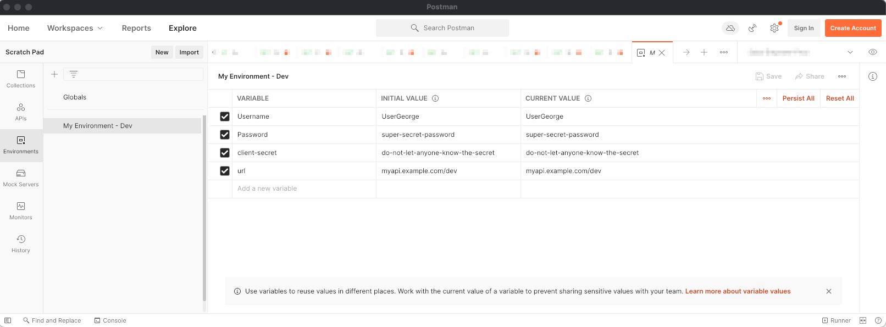

# Postman Environment Builder

A tool for creating a Postman environment from a table in a Markdown file.  It will retrieve secrets from Azure keyvaults if needed.

## Prerequisites

Postman Environment Builder is written in Python.  It runs on both Python 2 and Python 3.  It does not require any non-standard Python libraries.

Azure keyvault key retrieval depends on [the Azure CLI](https://docs.microsoft.com/en-us/cli/azure/).

## Usage

The environment builder builds an environment (bet you didn't see that coming) from a table in a markdown file.  The script requires two positional arguments, and accepts an optional third:

| Argument                      | What It Does |
| ----------------------------- | ------------ |
| #0 - Markdown File            | Path to the markdown file containing the table from which to build the environment |
| #1 - Postman Environment Name | Name to use in the program output as the name of the environment.  That is, what it'll be called in Postman. |
| #2 - Label in Markdown        | Optional.  If there are multiple tables in the Markdown file, this is a string in a preceding Markdown header to identify which table you'd like to use.  This is useful if, for example, you keep your Dev and Prod environments described in the same Markdown file. |

To run the environment builder with the optional "Label in Markdown" argument, your command will look like:

```bash
python3 -m PostmanEnvironmentBuilder.builder Markdown_File.md "My Environment - Dev" "Our API - DEV"
```

The markdown file for the above example might look something like:

```md
# My Documentation
Some documentation here

## Environments
We use Postman!  And APIs!  Whee!

### Environment for Our API - DEV
| Name          | Key Vault Name | Key Vault Value | Literal Value         |
|---------------|----------------|-----------------|-----------------------|
| Username      |                |                 | UserGeorge            |
| Password      | thesecretvault | george-password |                       |
| client-secret | thesecretvault | another-secret  |                       |
| url           |                |                 | myapi.example.com/dev |

### And for Our API - Prod
(another table)

## More useful info
...etc.
```

### Getting the environment into Postman

The environment that gets generated is printed to standard output (not secure from prying eyes, but avoids saving sensitive data to your local drive; even though Postman might do that on its own, at least it's one fewer place).

The output will look a bit like:

```text
Looking up george-password from thesecretvault using 'az keyvault secret show --vault-name "thesecretvault" -n "george-password"
Looking up another-secret from thesecretvault using 'az keyvault secret show --vault-name "thesecretvault" -n "another-secret"

    {
        "id": "My Environment - Dev",
        "name": "My Environment - Dev",
        "values": [
                {"key": "Username", "value": "UserGeorge", "enabled": true },
                {"key": "Password", "value": "super-secret-password", "enabled": true },
                {"key": "client-secret", "value": "do-not-let-anyone-know-the-secret", "enabled": true },
                {"key": "url", "value": "myapi.example.com/dev", "enabled": true }
        ],
        "_postman_variable_scope": "environment",
        "_postman_exported_using": "Postman/7.36.1"
    }
```

Copy the JSON part (the curly braces and everything in between).

In Postman, do what your version requires you to do to import data (screenshots are from v8.0.5 on MacOS).  In this version:

1. Click on `Environments` in the sidebar.  
1. Click `Import` in the toolbar above the list of environments. 
1. Click `Raw text` in the dialog box that pops up. 
1. Paste the JSON you copied earlier into the text box, then click `Continue`. 
1. Click `Import` to import the environment.  
1. To view your environment and verify everything imported as expected, click on the environment in the sidebar.  

Please note that subsequent Postman environment imports currently will create a duplicate environment for each import.  This has been a low-priority [known issue](https://github.com/postmanlabs/postman-app-support/issues/3365) for Postman for a while, with an easy workaround of deleting the old copy before importing.

## Background

My team, like most teams that spend time working with HTTP APIs, uses [Postman](https://www.postman.com/) a lot.  Our collections get stored in git, but that's a terrible place to store our [environments](https://learning.postman.com/docs/sending-requests/managing-environments/), becaue most of our environments contain [secrets and keys](https://blog.postman.com/how-to-use-api-keys/) that should not be checked into source control.

When a new person joins the team (or a team takes over work on an application), there is often a bit of work to get an environment file set up.  "What values do I need for dev?"  "Which key vault is the password stored in?"  "Is the secret stored as `secret_api_password` or `secret_password_for_api`?  'Cause we have both."

Sometimes we're diligent enough to update the documentation to point to the correct keyvaults--and maybe even keys.  But if we're going to go that far, why not go a tiny extra step, so we can let the machine do the tedious work of getting keys out of keyvaults and putting them in the right place?

## Development

To run the tests:

```bash
python3 -m unittest
```

Or, on Python 2

```bash
python -m unittest discover
```
